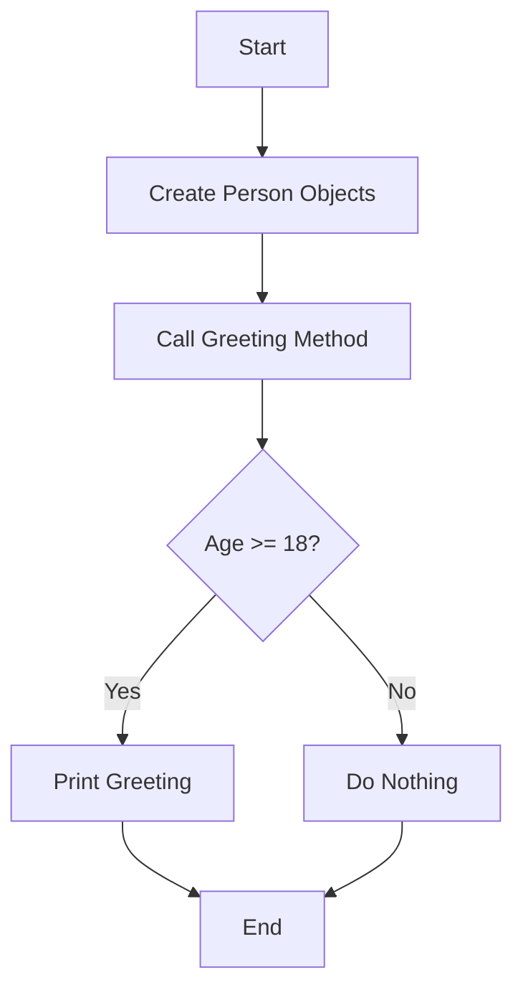

# 01 - OOP Basics

A fundamental introduction to Object-Oriented Programming in Python, focusing on class structure, the `__init__` method, and basic object instantiation.

## 📝 Description
This script defines a `Person` class with attributes for `name` and `age`. It demonstrates how to create multiple instances of a class and call methods based on conditional logic (e.g., checking if a person is of legal age).

## 📊 Logic Flow


## 💻 Code Snippet
```python
class Person:
    def __init__(self, name, age):
        self.name = name
        self.age = age
    def Greeting(self):    
        if self.age >= 18:
            print(f"Hey Everyone... My name is {self.name} and I am {self.age} years old")
```
