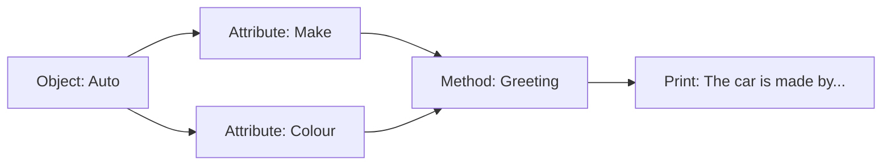

# 02 - Class Car

An exercise in modeling real-world objects (Cars) using classes and attributes.

## 📝 Description
The `Auto` class models a vehicle with a `make` and a `colour`. This script shows how to manage simple string attributes and use them within class methods to generate descriptive output.

## 📊 Logic Flow


## 💻 Code Snippet
```python
class Auto:
    def __init__(self, make, colour):
        self.make = make
        self.colour = colour
    def Greeting(self):    
        print(f"the Car is made by {self.make} and is painted {self.colour}.")
```
