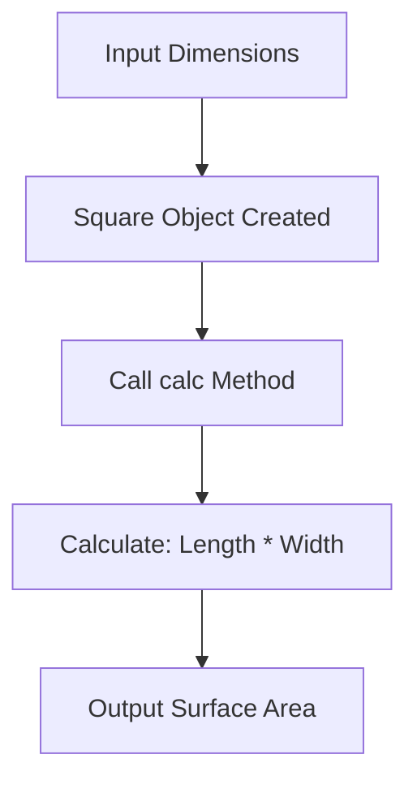

# 03 - Class Square

A mathematical exercise using OOP to calculate the surface area of geometric shapes.

## 📝 Description
This script defines a `Square` class that takes dimensions (Length and Width) and an identifier number. It includes a `calc()` method that performs multiplication to determine the area.

## 📊 Calculation Flow


## 💻 Code Snippet
```python
class Square:
    def __init__(self, number, Lenght, Width):
            self.Lenght = Lenght
            self.Width = Width
            self.number = number
    def calc(self):
          print(f" The surface area of square No. {self.number} is", self.Lenght*self.Width)
```
