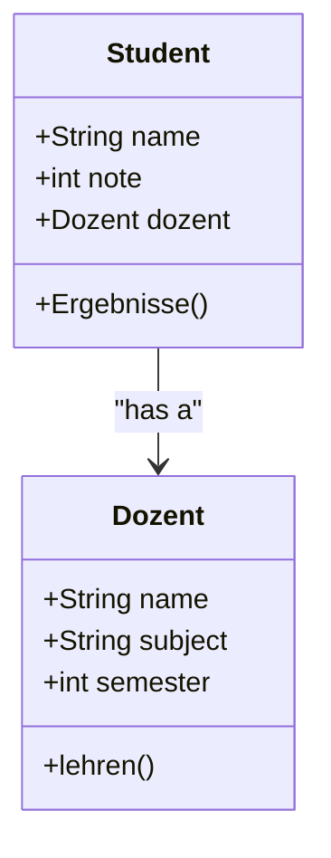

# 04 - OOP Students & Professors

A more complex demonstration of class interactions and object referencing in Python.

## 📝 Description
This script showcases how objects can interact with one another. A `Student` object is initialized with a reference to a `Dozent` (Professor) object, allowing the student to access the professor's data (like their name or the semester they teach).

## 📊 Class Relationship


## 💻 Code Snippet
```python
class Student:
    def __init__(self, name, note, dozent):
            self.name=name
            self.note=note
            self.dozent=dozent
    def Ergebnisse(self):
        if self.note > 91:
            print(f"the Student {self.name} in Semester {self.dozent.semester} with {self.dozent.name} passed with: A")
```
