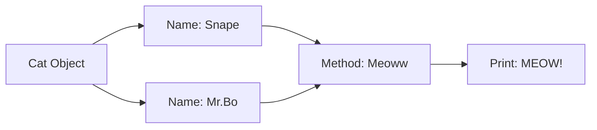

# 05 - Cats

A simple class modeling exercise featuring the `Cat` class.

## 📝 Description
This script demonstrates basic method definition (`Meoww`) and how to handle multiple instances of a simple object with shared behaviors.

## 📊 Logic Flow


## 💻 Code Snippet
```python
class Cat:
    def __init__(self, name, age):
        self.name = name
        self.age = age
    def Meoww(self):
        print(f"MEOW! Im {self.name} !")
```
