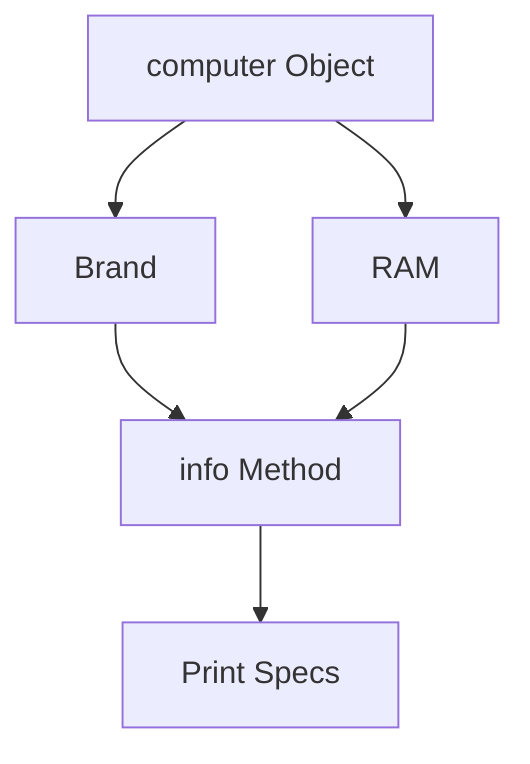

# 06 - Laptop

An exercise in modeling hardware components using Object-Oriented Programming.

## 📝 Description
The `computer` class models a laptop with a brand name and RAM capacity. It shows how to use string formatting within methods to display hardware specifications.

## 📊 Logic Flow


## 💻 Code Snippet
```python
class computer:
    def __init__(self, name, ram):
        self.name = name
        self.ram = ram
    def info(self):
        print(f"Laptop Brand: {self.name}\nRAM: {self.ram}GB")
```
