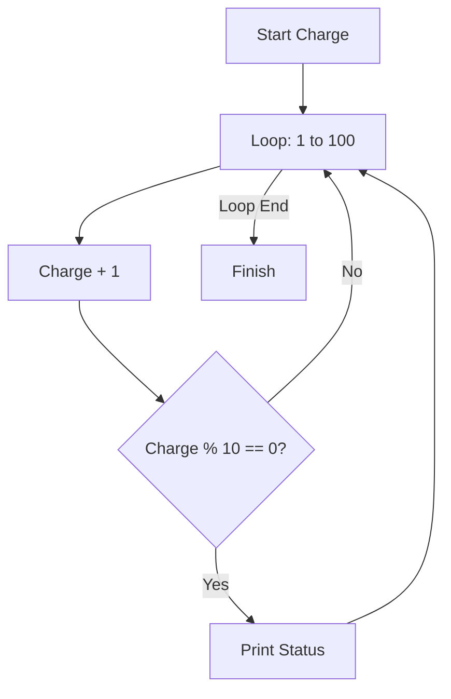

# 08 - Charging Simulation

A logic-based exercise simulating a phone's charging process using loops and modulo arithmetic.

## 📝 Description
The `handy` class simulates charging. It uses a `for` loop to increment the charge level and only prints the status when the level is a multiple of 10.

## 📊 Logic Flow


## 💻 Code Snippet
```python
def info(self):
    for i in range(0,100,1):
        self.charge = self.charge +1
        if self.charge <= 101 and self.charge%10==0:
            print(f"{self.brand} charge level: {self.charge}%")
```
