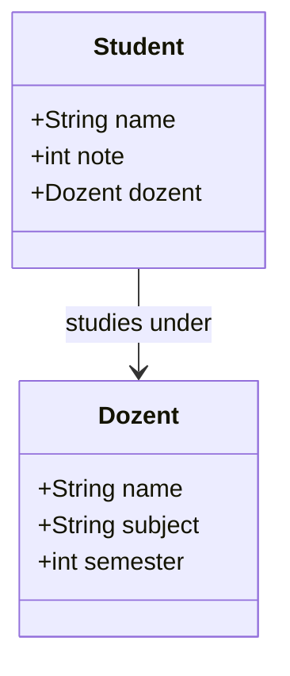
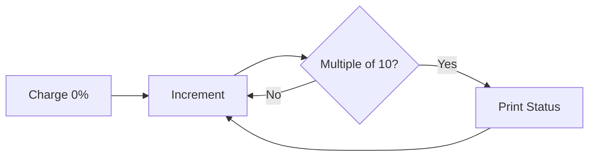

<h1 align="center">Object-Oriented Programming & Turtle Basics</h1>

 

This collection covers the fundamental concepts of Object-Oriented Programming (OOP) in Python and explores basic graphics using the `turtle` module.

 

---

 

<h2 align="center">🌟 Key Exercises</h2>

 

| Exercise | Description | Links |
| :--- | :--- | :--- |
| **01. OOP Basics** | Foundation of classes and objects. | [README](./01_OOP_Basics/README.md) |
| **02. Class Car** | Modeling real-world objects. | [README](./02_Class_Car/README.md) |
| **03. Class Square** | Geometric surface calculations. | [README](./03_Class_Square/README.md) |
| **04. Students & Profs** | Inter-class relationships and logic. | [README](./04_OOP_Students_Profs/README.md) |
| **05. Cats** | Simple method implementation. | [README](./05_Cats/README.md) |
| **06. Laptop** | Hardware modeling. | [README](./06_Laptop/README.md) |
| **07. Circle** | Attribute-based math calculations. | [README](./07_Circle/README.md) |
| **08. Charging Sim** | Loop logic and modulo arithmetic. | [README](./08_Charging_Simulation/README.md) |
| **09. Turtle Finland** | Graphical rendering of flags. | [README](./09_Turtle_Finland/README.md) |

 

---

 

<h2 align="center">💻 Featured Highlights</h2>

 

<h3 align="center">Class Relationships</h3>

  The Students and Professors exercise demonstrates how objects can hold references to other objects.

 

<h3 align="center">Graphical Logic</h3>

  The Charging Simulation uses loop iterations to simulate real-time status updates.

