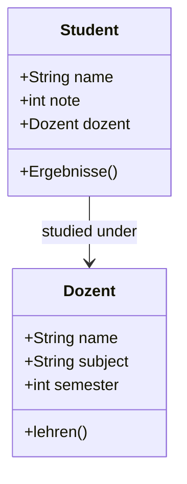

<h1 align="center">Object-Oriented Programming & Turtle Basics</h1>

<br>

This collection covers the fundamental concepts of Object-Oriented Programming (OOP) in Python and explores basic graphics using the `turtle` module.

<br>

---

<br>

<h2 align="center">🌟 Key Exercises</h2>

<br>

<h3 align="center">OOP Foundations</h3>
<p align="center">
  Demonstrates class definitions, object instantiation, and interaction between different classes (<code>Dozent</code> and <code>Student</code>).
</p>



<br>

<h3 align="center">Turtle Graphics</h3>
<p align="center">
  A basic introduction to drawing shapes and patterns using the Turtle graphics library, including flag designs.
</p>

<br>

---

<br>

<h2 align="center">💻 Code Highlight</h2>

```python
# From 04_OOP_students_and_profs.py
class Student:
    def __init__(self, name, note, dozent):
            self.name=name
            self.note=note
            self.dozent=dozent
            
    def Ergebnisse(self):
        if self.note > 50:
             print(f"the Student {self.name} in Semester {self.dozent.semester} passed")
        else:
            print (f"the Student {self.name} DID NOT PASS!!!")
```

<br>

---

<br>

<h2 align="center">📄 File Overview</h2>

- **`01 OOP.py`**: Basic `Person` class structure.
- **`02 class Car.py`**: Implementation of a Car object.
- **`03 Class square.py`**: Geometric shapes in OOP.
- **`04_OOP_students_and_profs.py`**: Advanced class interactions.
- **`05_CATS!.py`**: Simple class modeling.
- **`06_Laptop.py`**: Hardware modeling exercise.
- **`07_Circle.py`**: Mathematical calculations within classes.
- **`08_chargeing.py`**: Simulating state changes.
- **`Turtle Finland`**: Drawing exercises.
