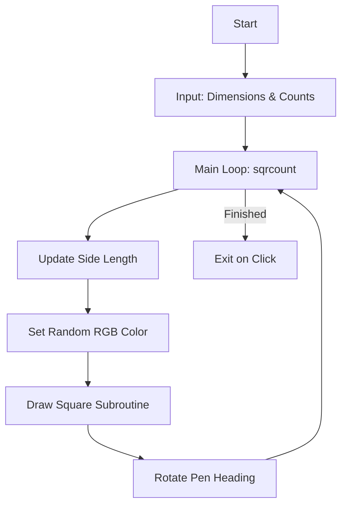

# 01 - Rotating Squares (ROTQUAD)

A generative art project using Python's `turtle` module to create complex, expanding geometric patterns.

## 📝 Description
This script uses nested loops and randomization to draw a sequence of rotating squares. Each square is larger than the previous one and is filled with a unique random color, creating a vibrant, hypnotic visual effect.

## 📊 Logic Flow


## 💻 Code Snippet
```python
def square(): #square subroutine
    for _ in range(4):
        t.forward(sqrlen) 
        t.right(90) 

for _ in range(1,sqrcount+1):
    sqrlen = sqrlen+(sqrlen*change/100)
    t.color(random.randint(0,255),random.randint(0,255),random.randint(0,255))
    t.begin_fill()
    square()
    t.end_fill()
    t.right((360*laps)/sqrcount)
```
