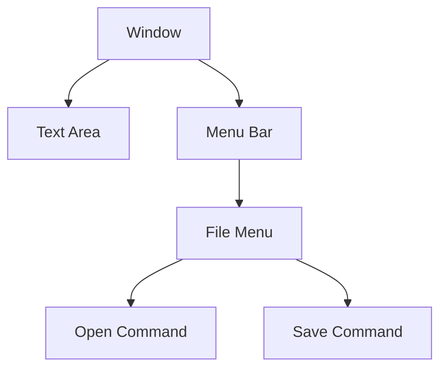

# 02 - Simple Text Editor

A prototype for a GUI-based text editor built with Python's `tkinter` library.

## 📝 Description
This project explores the basics of GUI development, including window management, text areas, and menu systems. It features functional "Open" and "Save" commands to interact with local text files.

## 📊 Application Structure


## 💻 Code Snippet
```python
def save_file():
    file=filedialog.asksaveasfile(defaultextension=".txt", filetypes=[("Text files", "*.txt")])
    if file:
            with open(file,"w") as f:
                f.write(text_area.get("1.0", tk.END))
```
