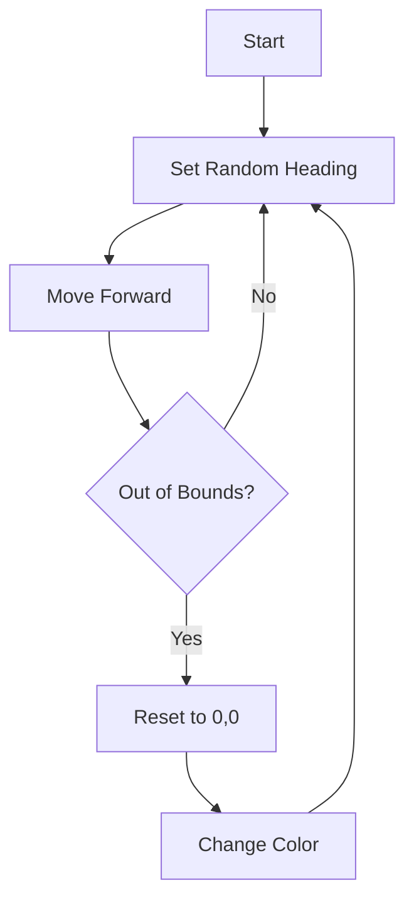

# 03 - Random Movement Simulation

A "drunkard's walk" simulation using `turtle` graphics with boundary detection.

## 📝 Description
This script simulates random Brownian-like motion. The turtle moves in random directions until it hits the invisible boundary box, at which point it teleports back to the center and changes color.

## 📊 Logic Flow


## 💻 Code Snippet
```python
for i in range (1,runlen*100):
    t.setheading(random.randint(0,360))
    t.forward(random.randint(0,50))
    # Boundary Detection
    if t.xcor() > 350 or t.xcor() < -350 or t.ycor() > 350 or t.ycor() < -350:
            t.setposition(0,0)
            t.color(random.randint(0,255),random.randint(0,255),random.randint(0,255))
```
