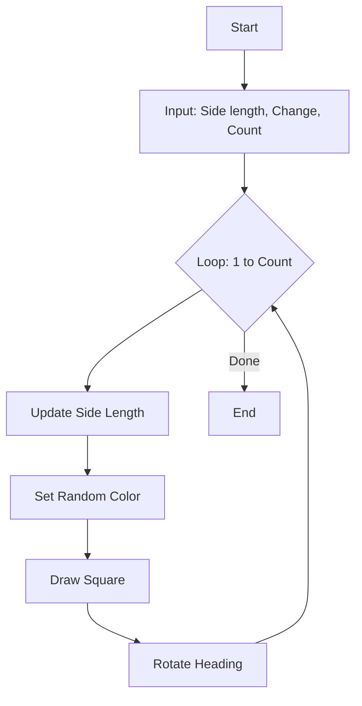

<h1 align="center">Graphics & Random Simulations</h1>

<br>

This section focuses on more advanced `turtle` graphics using randomization and loops, as well as an introduction to GUI development with `tkinter`.

<br>

---

<br>

<h2 align="center">🎨 Key Exercises</h2>

<br>

<h3 align="center">Rotating Squares Logic</h3>
<p align="center">
  A script that generates a series of rotating, expanding squares with randomized colors.
</p>



<br>

<h3 align="center">Random Movement</h3>
<p align="center">
  A "drunkard's walk" simulation where the turtle moves randomly within a defined boundary.
</p>

<br>

---

<br>

<h2 align="center">💻 Code Highlight</h2>

```python
# From 03_random movement.py
for i in range (1, runlen * 100):
    t.setheading(random.randint(0, 360))
    t.forward(random.randint(0, 50))
    
    # Boundary Detection & Reset
    if t.xcor() > 350 or t.xcor() < -350 or t.ycor() > 350 or t.ycor() < -350:
            t.setposition(0, 0)
            t.color(random.randint(0, 255), random.randint(0, 255), random.randint(0, 255))
```

<br>

---

<br>

<h2 align="center">📄 File Overview</h2>

- **`01_ROTQUAD.py`**: Dynamic generative art with rotating squares.
- **`02_editor.py`**: A basic text editor prototype using `tkinter`.
- **`03_random movement.py`**: Boundary-based random walk simulation.
