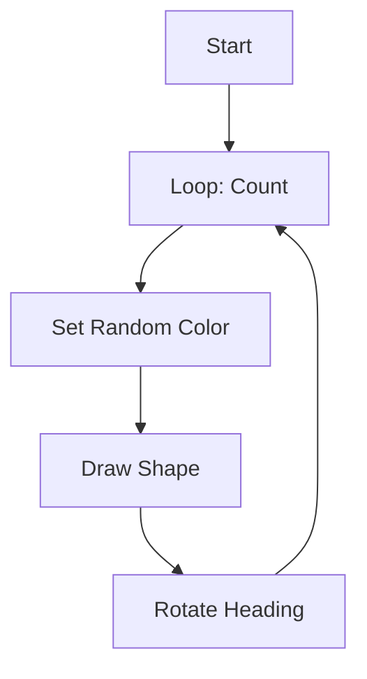
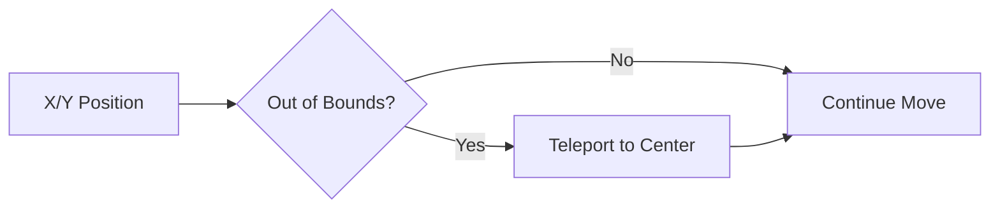

<h1 align="center">Graphics & Random Simulations</h1>

 

This section focuses on more advanced `turtle` graphics using randomization and loops, as well as an introduction to GUI development with `tkinter`.

 

---

 

<h2 align="center">🎨 Project Directory</h2>

 

| Project | Description | Documentation |
| :--- | :--- | :--- |
| **01. Rotating Squares** | Generative art with expanding geometric patterns. | [View Details](./01_Rotating_Squares/README.md) |
| **02. Simple Editor** | A basic text editor prototype using `tkinter`. | [View Details](./02_Simple_Editor/README.md) |
| **03. Random Movement** | A "drunkard's walk" simulation with boundary logic. | [View Details](./03_Random_Movement/README.md) |

 

---

 

<h2 align="center">📊 Simulation Logic</h2>

 

<h3 align="center">Rotating Pattern Flow</h3>

  The 01_ROTQUAD algorithm follows a strictly iterative path to generate its complex visuals.

 

<h3 align="center">Boundary Detection</h3>

  The Random Movement simulation uses coordinate checking to keep the turtle within the defined arena.

