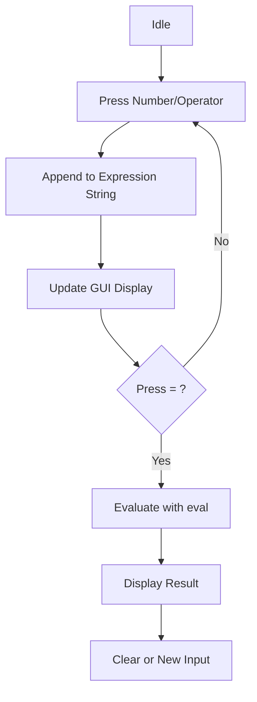

# 01 - BITLC Calculator

A fully functional graphical calculator built with Python's `tkinter` library.

## 📝 Description
This application features a dark-themed interface with a grid-based layout. It handles numerical inputs and basic arithmetic operations (addition, subtraction, multiplication, division) using global state management for the expression string.

## 📊 Logic Flow


## 💻 Code Highlight
```python
def equal():
    global expr
    try:
        result = str(eval(expr))
        display.set(result)
        expr = ""
    except:
        display.set("error")
        expr = ""
```
