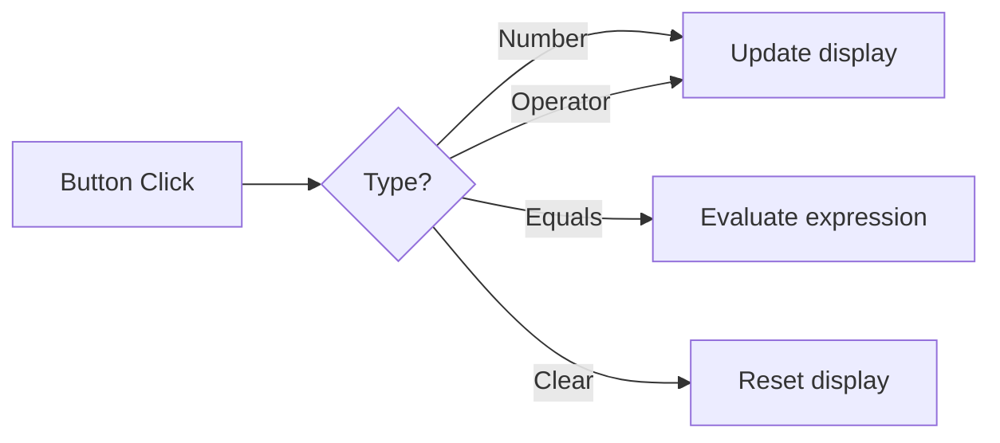

<h1 align="center">GUI Applications</h1>

 

This section contains standalone GUI applications built using Python's `tkinter` library, focusing on layout management and event handling.

 

---

 

<h2 align="center">🖥️ Application Directory</h2>

 

| Project | Description | Documentation |
| :--- | :--- | :--- |
| **01. BITLC Calculator** | A fully functional dark-mode arithmetic calculator. | [View Details](./01_BITLC_Calculator/README.md) |

 

---

 

<h2 align="center">🧮 Calculator Interface</h2>

  The calculator uses a 10-column grid to organize numerical and operator buttons.

