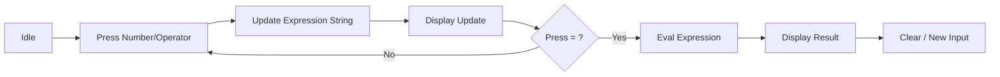

<h1 align="center">GUI Applications</h1>

<br>

This section contains standalone GUI applications built using Python's `tkinter` library, focusing on layout management and event handling.

<br>

---

<br>

<h2 align="center">🧮 Featured Project</h2>

<br>

<h3 align="center">BITLC Calculator</h3>
<p align="center">
  A fully functional graphical calculator capable of performing basic arithmetic operations. It features a dark-themed interface and a grid-based layout.
</p>



<br>

---

<br>

<h2 align="center">💻 Code Highlight</h2>

```python
# Calculation logic with error handling
def equal():
    global expr
    try:
        result = str(eval(expr))
        display.set(result)
        expr = ""
    except:
        display.set("error")
        expr = ""
```

<br>

---

<br>

<h2 align="center">📄 File Overview</h2>

- **`01_calculator.py`**: Tkinter-based calculator with custom styling, dark mode, and robust error handling.
